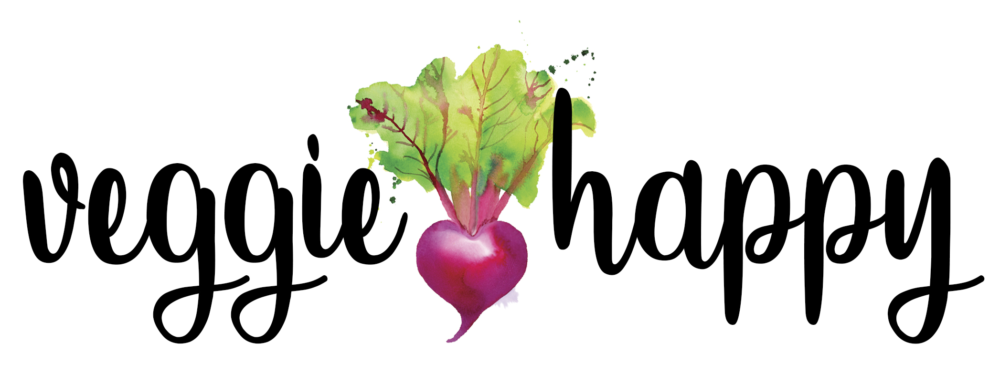
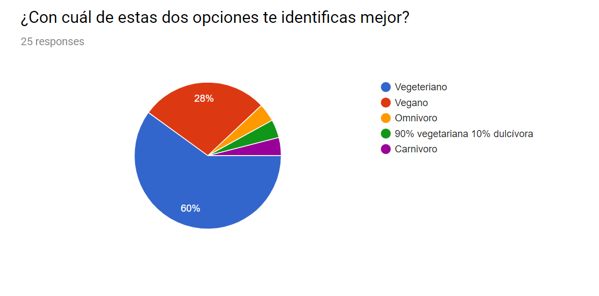
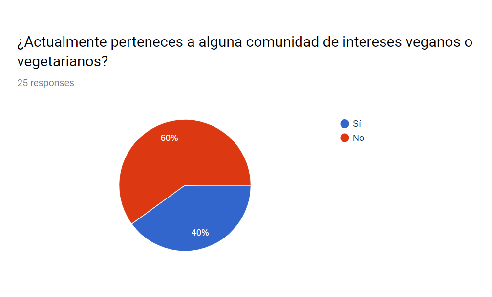
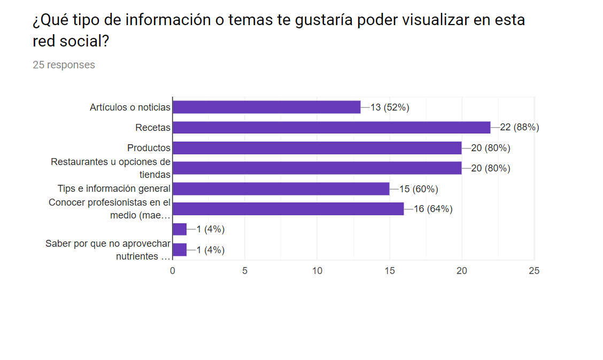
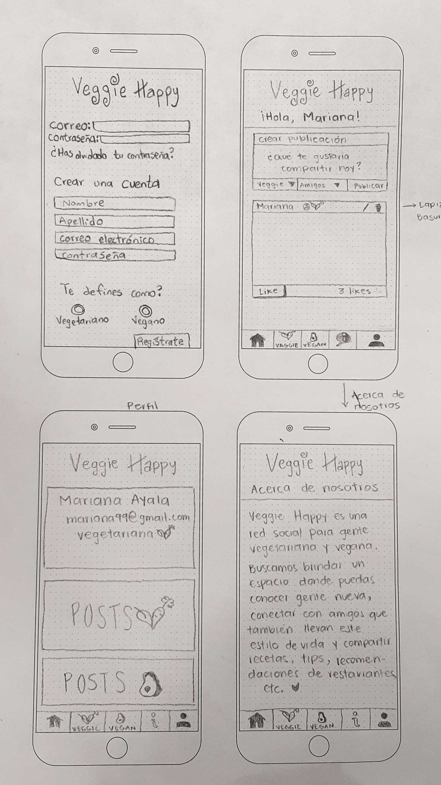
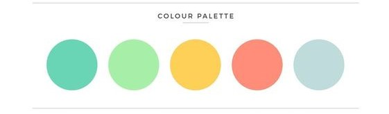
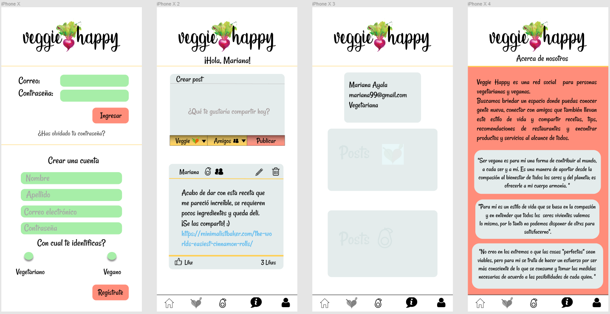

# Creating a social network

#### Project idea by Susy, Sofy and Ily | Development by Ily Trevino

## Definición del producto

¿Cómo surge la idea de Veggie Happy?

Mariana lleva cuatro meses siendo vegana y aunque le gustaría interactuar con más gente con el mismo estilo de vida (veganos y vegetarianos), se le ha hecho difícil conocer a más personas fuera de su círculo, así como lugares con más variedad para su alimentación.
A ella le gustaría formar parte de una red social donde pudiera encontrar productos, restaurantes, recetas o tips de la comunidad vegana/vegetariana y donde pudiera enterarse de eventos importantes de la comunidad (Tulum Veg Fest).

## Entrevistas con usuarios

Al momento de decidir la idea del proyecto las tres teníamos una idea de a dónde queríamos encaminar el proyecto y de el tipo de contenido que buscabamos ofrecer en nuestra red social. Sin embargo, decidimos aplicar una encuesta a gente que tiene un estilo de vida vegano y vegetariano para conocer si actualmente forman parte de alguna comunidad, qué tipo de contenido les interesa más y saber que representa para ellos tener este estilo de vida.

Realizamos la encuesta a 25 personas de ambos sexos y de amplio espectro en edad, para conocer una idea general de la necesidad que existe y del área de oportunidad que podíamos abordar con el proyecto.

### Análisis de resultados
>Al momento de obtener los resultados de la encuesta hubo tres preguntas en específico que nos ayudaron mucho a definir y aterrizar la idea del proyecto en mejor manera y con un fundamento mucho más sólido.
>
>#### Pregunta 1
>
>
>La mayoría de los usuarios encuestados se identifican como vegetarianos, por lo que decidimos que la red social sea para gente vegana y vegetariana.
>
>#### Pregunta 2
>
>Nos dimos cuenta también que la mayoría de los encuestados no forman parte actualmente de una comunidad con los mismos intereses o mismo estilo de vida, por lo que vimos un área de oportunidad para crear con nuestro proyecto una comunidad.
>
>#### Pregunta 3
>
>Por último, llegamos a la conclusión de que a la mayoría de los usuarios les interesa obtener información relacionada con comida, como tips de cocina, recetas, recomendación de restaurantes e incluso poder conocer gente profesionista del medio, como nutriólogos, para poder asesorarse en este ámbito de mejor manera.

## Prototipo de baja fidelidad

Para el diseño del prototipo de baja fidelidad tomamos elementos de diferentes redes sociales como inspiración:
- Página de registro / login
  - Para la pantalla inicial, donde el usuario ingresa a la red social o se registra por primera vez, usamos como referencia la página de Facebook web y su formato de ingreso de información.
- Barra de menú
  - Tomamos como inspiración el menú de Instagram. Nos gustó su posición en la parte inferior de la app, ya que no obstruye a la vista y no ocupa mucho espacio, sin embargo ofrece una navegación sencilla e intuitiva.
- Crear publicación
  - Para esta sección utilizamos también la página de Facebook como inspiración, adecuándola a un formato móvil sencillo para nosotros pero eficiente e intuitivo.
- Acerca de nosotros
  - Esta página contiene una breve descripción del proyecto, de cómo surgió la idea y tres citas dónde usuarios de nuestras encuestas nos respondieron la pregunta: "En tus propias palabras ¿qué significa para ti ser vegano o vegetariano y pertenecer a esta comunidad?"
- Mi perfil
  - En esta sección lo que se va a mostrar es la información básica con la que el usuario se registró: nombre, correo electrónico y el estilo de vida con el que se identifica más (vegetariano o vegano).

Después de esta lluvia de ideas y referencias, obtuvimos el siguiente resultado.

## Prototipo de alta fidelidad

Para generar el prototipo de alta fidelidad buscamos primero establecer una paleta de color que tuviera colores frescos y vivos. Revisamos varias páginas relacionadas a recetas de cocina veganas/vegetarianas y que tuvieran tips de alimentación, y nos dimos cuenta que la mayoría maneja un diseño muy sencillo de fondo blanco, letras negras, pero con acentos de colores que ayudan a que se vea bonito sin estar muy cargado.

Después de una votación en equipo nos decidimos por esta paleta de colores:

> Codigos de color: #69D5B5, #A7EEA8, #FED058, #FF8D7A y #BFDBDC.

Y teniendo esto como base procedimos a mezclar el diseño de nuestro prototipo de baja fidelidad con los acentos de colores, para obtener el siguiente resultado:

>Pantalla de inicio de sesion y registro; newsfeed; perfil del usuario; acerca de nosotros.

https://www.figma.com/file/DGwknuSiCURLQc58FenJxr/VeggieHappy
